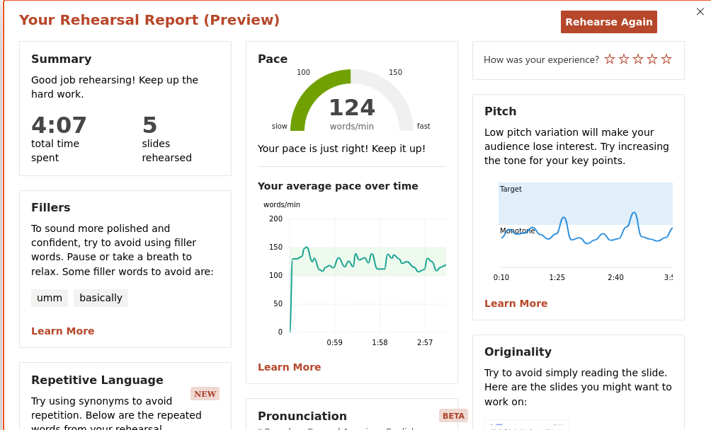

# Project Planning Template

## Reference

- Reference Paper:
  - [A. El Bouchti, S. El Kafhali, A. Haqiq, "Performance Analysis of Connection Admission Control Scheme in IEEE 802.16 OFDMA Networks," arXiv:1308.3127](https://arxiv.org/pdf/1308.3127)

---

# Basic Information

| Item | Information |
|---|---|
| Project Title | Connection Admission Control under Time-of-Day Modulated MMPP Packet Arrivals in IEEE 802.16 OFDMA Networks |
| Student ID / Name | M11402804 / Ahmad Rifqi Fadhlurrahman |
| Git Repository / Project Link | |
| Planning Approval Date | YYYY-MM-DD|

---

# Part A. Detailed Project Planning

## A1. Project Summary

**Problem to be solved:**
The reference paper studies a Connection Admission Control (CAC) scheme for IEEE 802.16 OFDMA networks. It builds a DTMC where connection arrivals are Poisson and, within a connection, packet arrivals follow a two-state MMPP with fixed ON/OFF rates (λ₀, λ₁). The paper solves this chain for its steady state and reports the usual QoS metrics from it: connection blocking probability, packet dropping probability, queue throughput, and average delay. All of that rests on one assumption — that λ₁ is a single constant.

Real multimedia traffic doesn't behave that way. The ON-state burst intensity of voice and video inside an active connection tends to be higher during peak hours than off-peak, and a fixed λ₁ can't express that. So the question this project asks is simple: when the paper's curves are calibrated to one λ₁, how far off are they for the peak-hour conditions an operator actually faces?

**Key challenges:**
1. Making λ₁ depend on time of day breaks the convenient part of the model. The original DTMC is time-homogeneous, so it's solved once for a single stationary π. Once λ₁ = λ₁(t), the transition matrix becomes P(λ₁(t)), the equation πP = π loses its meaning (there is no single stationary π to balance a matrix that keeps changing), and "steady state" has to be replaced by a trajectory or a periodic (cyclostationary) solution. Importantly, this does **not** require re-deriving Q and P — the paper's matrices are already functions of λ₁, so the same construction (Eq. 5–9) is reused and only the *solve* changes (fixed-point → forward propagation over the day). The cost is computation and a new notion of equilibrium, not new theory.
2. The project needs a cheap approximation for the bulk of the work and a genuine time-varying solve to justify it. The cheap approximation is quasi-stationary: treat λ₁ as regime-dependent and re-solve the *existing, unmodified* DTMC once per regime, pretending each moment of the day is a frozen, fully-settled world. The genuine time-varying solve (Scenario 4) then measures how wrong that pretence is — which is both the validation of Scenarios 1–3 and the part of the project that actually earns the "time-of-day modulated" title.
3. The paper's admission threshold C, buffer size L = 150, and queue-truncation constant (C_tr = 25) were all tuned around one λ₁. These need to be confirmed to still behave numerically when λ₁ is pushed to higher peak values — that P still truncates cleanly and π still converges.

**Proposed method:**
Leave every equation in the paper untouched — the CAC threshold policy, the connection-level transition matrices Q (Eq. 5–6), the queue-level matrices V and P (Eq. 7–9), and the performance formulas (Eq. 11–18). Then define a few named **regimes** — off-peak, peak, and possibly a mid-level transition — each just a different fixed value of λ₁. λ₀ and the MMPP transition rates q₀₁, q₁₀ stay the same across regimes, since those govern how bursts *behave*, not the time-of-day *intensity*. For each regime, solve the paper's stationary DTMC (πP = π, π·1 = 1) independently using the same numerical procedure it describes, and recompute all six performance metrics.

That much is a parameter sweep over an already-published model — low risk, and it produces a real empirical result: how far apart peak and off-peak QoS actually are. Two further layers build on it, and it is worth keeping them cleanly separate:
- **(1) The convexity/Jensen bias — a *quasi-stationary* result, belonging to Scenario 2.** Because p_drop and D are convex in load, composing the fine λ₁-sweep with a daily profile λ₁(t) already shows that QoS *averaged over a swinging λ₁(t)* is systematically worse than QoS at the mean λ₁ (Jensen's inequality) — so a single-λ₁ analysis is biased, not merely imprecise. This needs no dynamics; it follows from the static curve alone.
- **(2) The transient effect — the genuinely *dynamic* result, belonging to Scenario 4.** Putting the true time-varying λ₁(t) back in and solving the time-inhomogeneous chain directly (π(t+1) = π(t)·P(λ₁(t)), plus a cyclostationary solution for a periodic day) adds what the static curve cannot show — lag, overshoot, and hysteresis — and is what makes the "time-of-day modulated" framing literal rather than a label.

**Expected outcomes:**
Blocking probability, packet dropping probability, and average delay should all rise with λ₁. The peak-regime curves should sit measurably above the paper's original (average-λ₁) curves, and the off-peak curves measurably below. The main deliverable is an answer to a concrete operator question: if you size C from the paper's single-λ₁ analysis, how much headroom do you actually lose during peak hours, and how much capacity sits idle off-peak?

---

## A2. System Architecture

### System Assumptions

- A single subscriber-station queue, as in the paper: five allocated subchannels, each 160 kHz, a one-millisecond subframe, BPSK/rate-1/2 giving 80 kbps per subchannel.
- Connection arrivals: Poisson with rate ρ (unchanged from the paper).
- Connection duration: exponential with rate μ (unchanged; the paper uses μ = 1/10 per minute, i.e. 10-minute connections on average).
- Packet arrivals per connection: a two-state MMPP with OFF-state rate λ₀ and ON-state rate λ₁, transition-rate matrix Q_MMPP with entries q₀₁, q₁₀, as in Eq. (1).
- **New assumption (this project):** λ₁ is no longer a single value. For Scenarios 1–3 it is swept over a fine grid (≈ 50–100 points, with off-peak/baseline/peak kept only as named markers), λ₀, q₀₁, q₁₀ held fixed, and each grid point solved as its own stationary system (the point-wise/quasi-stationary approximation). For Scenario 4 it becomes a genuine function λ₁(t) and the chain is solved time-inhomogeneously (forward propagation / cyclostationary), reusing the same matrices. So the plan uses the quasi-stationary view for the cheap bulk and the time-inhomogeneous view only where the dynamics actually matter.
- The admission threshold C caps the number of ongoing connections, following the paper's CAC policy (Section II.B).
- Buffer size L = 150 packets (as in the paper); maximum packets arriving per connection per frame A = 30 (as in the paper).
- QoS requirement: the comparison target is the paper's own reported performance under its single fixed λ₁. This project doesn't set a new absolute QoS threshold; it measures the **relative deviation** between regimes and that baseline.

### Environment

- **Subscriber Station (SS):** aggregates uplink traffic from all admitted connections into one finite queue (size L); its CAC module accepts or rejects new connection requests against threshold C.
- **Base Station (BS):** allocates subchannels to the SS. The SNR and subchannel-bandwidth setup matches the paper's numerical results (5 dB average SNR, 160 kHz per subchannel).
- **Regime clock (new):** an external, out-of-band signal — not part of the DTMC state space — that picks which λ₁ value is active for a given solve. It stands for the operator's time-of-day context, not a state the CAC observes or reacts to in real time.

### Input Parameters

- ρ: connection arrival rate (Poisson); paper value 0.4 connections/minute
- μ: connection departure rate; paper value 1/10 per minute
- λ₀: MMPP OFF-state packet rate (fixed across regimes); paper value 1 packet/frame
- λ₁(regime): MMPP ON-state packet rate — **swept across regimes** instead of fixed. The paper's original value (2 packets/frame) is the "average"/baseline regime, with lower and higher values defining off-peak and peak
- q₀₁, q₁₀: MMPP transition rates (fixed across regimes)
- C: admission threshold (connection-count limit), varied per scenario as in the paper
- L: buffer size (150 packets, fixed)
- A: max packets arriving per connection per frame (30, fixed)
- Average SNR per subchannel (5 dB, fixed, as in the paper's channel-quality scenarios)

### Output Parameters

- p_block: connection blocking probability, Eq. (11) — **computed per regime**
- N_k: average number of ongoing connections, Eq. (12) — per regime
- N_j: average queue length, Eq. (13) — per regime
- p_drop: packet dropping probability, Eq. (14)–(15) — per regime
- η: queue throughput, Eq. (17) — per regime
- D: average packet delay, Eq. (18) — per regime
- Δ(metric): the gap between the peak-regime value and the paper's single-λ₁ value, and the matching off-peak gap, for each of the six metrics above. This delta is the project's key new output.

**System block diagram (to be produced):**
The diagram reuses the paper's Figure 1 (system model: BS ↔ multiple SS, each SS folding its connections into one queue) and Figure 2 (the DTMC state-transition diagram), with one addition: a "Regime Selector" block feeding the MMPP rate matrix Λ = diag(λ₀, λ₁), with λ₁ shown as regime-dependent (λ₁^off-peak / λ₁^peak / λ₁^transition) rather than a single constant. The rest of the pipeline — Q (connection-level transitions, Eq. 5–6) → V, P (queue-level transitions, Eq. 7–9) → steady-state solve (πP = π) → performance metrics (Eq. 11–18) — is drawn exactly as in the paper, run once per regime as parallel branches that meet again at a final "cross-regime comparison" block.

---

## A3. Expected Deliverables and Validation

### Validation Method

- **Experimental environment:** a numerical solution of the DTMC (MATLAB, or an equivalent that replicates the paper's solver), not discrete-event simulation. This matches the paper's own approach (Section V: "we use the Matlab software to solve numerically").
- **Parameter baseline (reused from the paper, Section V.A):** five subchannels, 160 kHz each, 1 ms subframe, 80 kbps/subchannel at rate ID 0; A = 30; L = 150; μ = 1/10 per minute; average SNR 5 dB; base λ₀ = 1 packet/frame, base λ₁ = 2 packets/frame (this becomes the baseline/average regime here).
- **New parameter sweep:** λ₁ swept over a **fine grid of ≈ 50–100 points** across the off-peak→peak range (dense enough to read as continuous), with the named values — λ₁^off-peak ≈ 1.2–1.5, λ₁^baseline = 2 (the paper's value), λ₁^peak ≈ 3–4 packets/frame — kept only as highlighted markers on that grid. λ₀, q₀₁, q₁₀, ρ, μ, C, L, A are held fixed within each solve. The same fine grid is used for *both* the connection-level (Scenario 1) and packet-level (Scenario 2) metrics, since they come from the same π.
- **Software:** MATLAB (or a Python/NumPy equivalent) solving πP = π, π·1 = 1, rebuilding the paper's matrices (Eq. 5–9) exactly and running once per grid point, plus a small custom discrete-event simulator for the transient cross-check in Scenario 4.
- **ns-3 (Scenario 5 only):** the WiMAX/802.16 module (`src/wimax`), obtained through the ns-allinone bundle or the ns-3 App Store since it's no longer in ns-3 mainline. It's used only for the protocol-accurate cross-validation, not for Scenarios 1–4, which stay inside the analytical/lightweight-simulation toolchain.

### Experiment Scenario 1: Connection-Level Sensitivity to λ₁ Regime

- **Design:** For a fixed admission threshold C (one of the paper's tested values) and a fixed connection arrival rate ρ, solve the DTMC on the **same fine λ₁ grid used in Scenario 2** (≈ 50–100 points across off-peak→peak, dense enough to read as continuous), with the three named regimes kept only as highlighted markers on that grid, and record connection blocking probability p_block and average ongoing connections N_k as continuous curves p_block(λ₁), N_k(λ₁). The cost is identical to the packet-level sweep — it is the same stationary solve of the same π, just reading a different marginal — so there is no reason to sample the connection level any coarser than the packet level.
- **Baseline:** The paper's single-λ₁ (λ₁ = 2 packets/frame) results, reproduced exactly first as a sanity check before the sweep is introduced.
- **Purpose:** Find out whether connection-level metrics respond to λ₁ at all. The paper's own Figure 11 shows connection blocking is largely insensitive to *channel quality*, but λ₁ can affect queue occupancy indirectly — packet-level congestion feeds back into effective service capacity — so this scenario checks whether that indirect coupling is strong enough to matter at the connection level.
- **Expected result:** The baseline reproduction should match the paper's Figures 3–4 closely (a model-fidelity check). Across the full fine sweep, p_block(λ₁) and N_k(λ₁) are expected to trace an essentially **flat, horizontal line** (near-zero slope), because C caps the connection count directly and admission never inspects the queue, so λ₁ — a packet-level parameter — is structurally decoupled from the connection marginal. Resolving that flatness over ~100 points is much stronger evidence of the decoupling than three points could give, and it is exactly what licenses Scenario 2's claim that the *entire* λ₁ effect lives at the packet level. (If instead a non-trivial slope appears, that itself is a finding — it would mean the model carries a cross-layer coupling worth reporting.)

### Experiment Scenario 2: Packet-Level Sensitivity to λ₁ Regime

- **Design:** For the same fixed C and ρ, solve the DTMC per regime and record packet dropping probability p_drop, queue throughput η, and average delay D, sweeping λ₁ across the full off-peak → baseline → peak range.
- **Baseline:** The paper's single-λ₁ packet-level results (Figures 5–8), reproduced first as a fidelity check, then compared against each regime.
- **Purpose:** This is the core test of the hypothesis. The paper notes that packet-level performance is "significantly impacted" by connection arrival rate, so it's reasonable to expect packet-level metrics to be just as sensitive to λ₁ directly, since λ₁ drives the mean MMPP rate λ_MMPP (Eq. 3), which appears straight in the throughput and dropping-probability formulas (Eq. 14–17).
- **Expected result:** p_drop and D rise monotonically and non-trivially with λ₁. The peak-regime curve sits measurably above the single-λ₁ baseline at every ρ tested, and the off-peak curve below it — which quantifies the "headroom gap" a single-λ₁ analysis leaves behind.

- **Discrete regimes vs continuous λ₁ (Option A):** Because the sweep already runs on the fine ≈ 50–100-point grid (see Validation Method), p_drop, D, and η come out as smooth curves f_metric(λ₁) rather than three isolated regime points — the named regimes are just markers on those curves. This adds no new machinery — it is the same stationary solve, read at more values of λ₁ — but the continuous curve enables two checks that a 3-point discretization cannot support:
  - **Does the discrete 3-regime view mislead, versus a continuous λ₁?** Overlay the three regime points on the continuous curve. Because p_drop and D are *convex* in λ₁, straight-line reading between three points **understates the curvature** — it can hide a saturation knee and, more importantly, misjudge any average taken over λ₁. The fine curve quantifies exactly how much the coarse discrete picture distorts the packet-level story, which is the point of adding it here.
  - **Cheap quasi-stationary trajectory metric(t) ≈ f_metric(λ₁(t)):** composing the continuous curve with any time-of-day profile λ₁(t) yields an instantaneous-QoS trajectory *for free*, with no time-stepping — you just look up f_metric at the current λ₁(t). This is precisely the quasi-stationary prediction curve that Scenario 4 measures its true time-inhomogeneous solve against. By construction it stays blind to lag and overshoot; that blindness is deliberate, and it splits the two effects cleanly. The gap between this composed trajectory's day-average and the value at mean λ₁ **is** the Jensen bias — and that is delivered *here*, by Scenario 2, with no dynamics needed. The remaining gap, between this composed trajectory and Scenario 4's forward-propagated trajectory, **is** the genuine transient (lag/overshoot/hysteresis) effect — and that belongs to Scenario 4. So Option A owns the convexity bias outright and doubles as the baseline that makes Scenario 4's transient effect measurable.

### Experiment Scenario 3: Threshold Re-Provisioning Under Peak-Regime Constraint

- **Design:** Using the peak-regime λ₁, sweep the admission threshold C to find the smallest C that keeps p_drop and D at or below the levels the baseline (λ₁ = 2) reached at the paper's originally reported C.
- **Baseline:** The paper's originally reported C under baseline λ₁.
- **Purpose:** Turn the regime-sensitivity finding into an actual recommendation. If peak-hour traffic needs a stricter (lower) threshold to hold the same QoS the paper reports, quantify how much stricter.
- **Expected result:** The peak-safe threshold C_peak comes in lower than the baseline C, giving a concrete "how much headroom to reserve for peak hours" number an operator can use directly.

### Experiment Scenario 4: Genuine Time-Varying λ₁(t) — Cyclostationary and Transient Response

This is the scenario that earns the "time-of-day modulated" framing. Everywhere else in the plan λ₁ is a constant that has merely been *re-labelled* as a time of day; here λ₁ is an actual function λ₁(t), the chain is genuinely time-inhomogeneous, and the whole point is to (i) solve it properly and (ii) measure how badly the frozen, constant-λ₁ view of Scenarios 1–3 misrepresents it. So Scenario 4 is simultaneously the project's main contribution and the validity check on everything before it.

- **Why this is tractable (no re-derivation):** the base paper's transition matrix is already built as a function P(λ₁). Making λ₁ time-varying reuses that exact construction (Eq. 5–9) and changes only the *solve* — a fixed point πP = π becomes a forward propagation π(t+1) = π(t)·P(λ₁(t)). Same MATLAB/Python environment as Scenarios 1–3, no new theory.

- **4a. Define an explicit time-of-day profile λ₁(t).** Replace the constant λ₁ with a periodic daily profile spanning the same off-peak→peak range used in Scenarios 1–3 — e.g. a smooth sinusoid λ₁(t) = λ̄ + Δλ·sin(2πt/T_day), or a piecewise diurnal curve (flat off-peak → morning ramp → flat peak → evening ramp down). λ₀, q₀₁, q₁₀, ρ, μ, C stay fixed; only λ₁ moves. The frame (1 ms) is the propagation step; T_day (or the ramp width) is the modulation timescale — the two differ by many orders of magnitude, which is exactly the structure the next step exploits.

- **4b. Establish the timescale hierarchy first (the decisive step).** Before any transient run, read the chain's relaxation time off the eigenvalues of P: τ_relax ≈ 1/(1 − |λ₂|), with λ₂ the second-largest-magnitude eigenvalue. This model carries two of them — a *fast* packet/queue relaxation and a *slow* connection relaxation (~1/μ ≈ 10 min). Compare each against the modulation timescale T_var of λ₁(t):
  - τ_relax ≪ T_var → that layer tracks λ₁(t) adiabatically and the quasi-stationary approximation is accurate for it;
  - τ_relax ≳ T_var → that layer lags, and a genuine transient (lag, overshoot, hysteresis) appears.
  This is also what resolves the apparent conflict with Scenario 1. λ₁ forces only the packet layer, whose τ_relax is small, so the prediction is that the queue tracks λ₁(t) almost adiabatically while the connection layer barely responds — meaning any real transient is *fast* (queue timescale, seconds), **not** on the connection-lifetime scale. This corrects the naive "settles over several 1/μ" expectation and turns it into something the scenario measures rather than assumes.

- **4c. Solve the time-varying chain two ways.**
  - **Cyclostationary (periodic) steady state — the honest "long-run" answer:** for a periodic λ₁(t) of period T_day = N frame-steps, the long-run behavior is not a fixed point but a repeating loop π*(t) = π*(t+T_day). Solve it directly as the eigenvector-with-eigenvalue-1 of the one-period product (monodromy) matrix M = P(λ₁(0))·P(λ₁(1))···P(λ₁(N−1)), i.e. π*(0)·M = π*(0); propagating π*(0) through one period gives the exact daily trajectory of every QoS metric. This is the replacement for "steady state" once the system is time-driven.
  - **Transient forward integration:** starting from an off-peak steady state, march π(t+1) = π(t)·P(λ₁(t)) across one or more days and record p_drop(t), D(t), η(t) as time series — capturing start-up transients, convergence toward the cyclostationary loop, and any overshoot at the steepest part of the ramp.

- **4d. Headline deliverable — the transient (dynamic) error.** For each packet-level metric, overlay three daily curves: (i) the true time-varying trajectory from 4c, (ii) the quasi-stationary prediction (the continuous-sweep composition f_metric(λ₁(t)) from Scenario 2's Option A), and (iii) the single-constant-λ₁ baseline the base paper reports. Scenario 4's *own* contribution is the gap **(i) − (ii)**: the error of the quasi-stationary approximation — the part of reality that appears only once the chain is solved *with memory*. Small ⇒ the constant-λ₁ shortcut is *proven* safe and Scenarios 1–3 are vindicated; large (lag, overshoot, hysteresis) ⇒ the time-inhomogeneous model is *necessary*, and the title is earned by demonstration. Either way it is a real, publishable finding.
  - *Shown for context, not claimed as Scenario 4's own:* the other gap on the same plot, **(ii) − (iii)**, is the Jensen/convexity bias. It is a quasi-stationary result already delivered by Scenario 2 (Option A) — it needs no dynamics — and is drawn here only so both effects sit on one figure. Scenario 4 does not produce it and should not claim it.

- **4e. Cross-checks.** (a) A lightweight discrete-event simulator (C/Python/MATLAB, not ns-3) generating Poisson connections and a true time-varying two-state MMPP driven by λ₁(t), tracking the queue frame-by-frame as the paper's frame model does, to confirm the forward-integration trajectory of 4c independently of the matrix algebra. (b) ns-3 (Scenario 5d) drives the identical λ₁(t) for protocol-accurate confirmation.

- **Baseline:** The steady-state values from Scenarios 1–3 are the endpoints the trajectory should visit (its instantaneous values at the off-peak and peak extremes of λ₁(t)); any deviation between the trajectory and those endpoints *is* the transient effect being measured.
- **Purpose:** Turn "time-of-day modulated" from a label into a measured *dynamic* result — the daily QoS trajectory, the settling behavior after the peak ramp, and the size of the quasi-stationary (transient) error. The convexity/Jensen bias is displayed alongside for completeness but is credited to Scenario 2, since it needs no dynamics.
- **Expected result:** because packet-layer τ_relax ≪ T_day, the true trajectory is expected to hug the quasi-stationary prediction through most of the day, deviating (lag, mild overshoot) only near the steepest ramp, and settling after a step change on the fast queue timescale (seconds) rather than the connection timescale — correcting the earlier "several 1/μ" claim. In other words, the transient error (i) − (ii) is expected to be *small* here — a result that **vindicates** Scenario 2's cheap quasi-stationary shortcut rather than overturning it. (The separate Jensen gap between the quasi-stationary day-average and the mean-λ₁ value is expected to be non-negligible, but that is Scenario 2's finding, established without dynamics.)
- **Optional stretch goal (ns-3):** validating λ₁(t) against realistic 802.16 MAC-layer behavior (frame scheduling, contention, channel effects) is handled as Scenario 5d rather than an ad-hoc extra here; beyond that, no further tooling is needed to answer the time-varying question, which is fully addressed by 4a–4e.

---

### Experiment Scenario 5: Protocol-Accurate Cross-Validation with ns-3 (802.16 MAC/PHY) — Full Coverage

- **Scope:** Scenarios 1–4 all live at the abstraction level of the paper's DTMC — frames as generic time slots, no real contention or signaling overhead. Scenario 5 cross-checks **all four** of them, not just the transient one, against a protocol-accurate simulation in **ns-3's WiMAX module** (`src/wimax`). That module implements PMP mode and the WirelessMAN-OFDM PHY, including the MAC Common Part Sublayer (framing, bandwidth request/grant, uplink/downlink scheduling) that the analytical model leaves out.
- **Common setup (shared across 5a–5d):**
  - **Tooling note:** the WiMAX module is no longer part of ns-3 mainline — it ships as a separately bundled contributed module through ns-allinone (or the ns-3 App Store). Budget setup time for fetching and building it, and for confirming it still compiles against the ns-3 version in use before relying on it.
  - **Topology:** one Base Station and one Subscriber Station in PMP mode, matching the paper's single-SS-per-queue assumption (Section II.A). Configure five subchannels at 160 kHz each, a 1 ms subframe, and BPSK/rate-½ (rate ID 0, 80 kbps/subchannel) to match the paper's numerical setup in Section V.A as closely as ns-3's WiMAX attributes allow.
  - **Traffic generation:** ns-3 has no built-in continuously time-varying MMPP source, so drive the SS uplink queue with a custom Application (or a scheduled sequence of OnOffApplication reconfigurations) implementing the same two-state MMPP used throughout the plan — held fixed per regime for 5a–5c, and varying continuously as λ₁(t) for 5d. That way every ns-3 run is driven by the same arrival-process definition as its analytical counterpart, not just a similar-looking one.
  - **Admission control:** implement the same threshold-C CAC policy (Section II.B) at the SS, since ns-3's WiMAX module doesn't include admission logic. This one implementation is reused unchanged across 5a–5d.
  - **Build order:** build this shared setup once and validate it against the easiest analytical case first (5a, single-regime steady state) before moving on to 5b–5d, so setup bugs surface early instead of compounding across four increasingly complex runs.

- **5a. Steady-state connection-level replication (cross-checks Scenario 1):** Run ns-3 to steady state under each fixed λ₁ regime (off-peak / baseline / peak) with the same C and ρ as Scenario 1, and record connection blocking probability and average ongoing connections (averaged over a run long enough to be statistically stable). Compare directly against Scenario 1's DTMC p_block and N_k per regime.
  - *Expected result:* close agreement with Scenario 1, since the connection-level admission logic is the same in both. This run mainly confirms the ns-3 topology and CAC implementation are correct, and it's the natural first checkpoint before trusting 5b–5d.

- **5b. Steady-state packet-level replication (cross-checks Scenario 2):** The same per-regime ns-3 runs as 5a, but recording p_drop, η, and D from actual packet traces rather than the analytical formulas. Compare against Scenario 2's per-regime curves.
  - *Expected result:* this is where the first real divergence from the analytical model should show up. ns-3's p_drop and D are expected to run somewhat higher than the DTMC's predictions at every regime, because of bandwidth request/grant overhead the analytical model doesn't represent, with the gap likely widest at the peak regime where contention is worst.

- **5c. Threshold re-provisioning validation (cross-checks Scenario 3):** Using the peak regime, sweep C in ns-3 (same sweep as Scenario 3) and find the smallest C that keeps ns-3's own measured p_drop/D at or below the ns-3 baseline-regime levels from 5b — ns-3 against ns-3, not against the analytical baseline, since that isolates whether the *recommendation* changes once protocol overhead is counted.
  - *Expected result:* the ns-3 C_peak should be equal to or stricter than Scenario 3's analytical C_peak, since real MAC overhead cuts effective capacity below what the DTMC assumes. If so, Scenario 3's threshold is a lower bound rather than a safe estimate on its own.

- **5d. Transient response validation (cross-checks Scenario 4):** As scoped above — drive ns-3 with the same continuously varying λ₁(t) profile defined in Scenario 4a, and compare the resulting p_drop(t)/D(t) trace against Scenario 4's time-inhomogeneous analytical trace (4c) and its lightweight-simulator cross-check (4e).
  - *Expected result:* the overall shape (p_drop/D rising toward the peak-regime steady state) holds up in ns-3, but with a longer settling time and probably some overshoot beyond what Scenario 4 predicts, consistent with the steady-state gap already seen in 5b.

- **Purpose (overall):** find out how much of *every* analytical finding in the plan — not just the transient one — survives once real MAC-layer effects (bandwidth request/grant round-trips, scheduling overhead, contention) are added, and put a number on each gap. Those gaps are the scenario's real deliverable: they estimate how much QoS margin the paper's (and this plan's) analytical predictions might be overstating in a real deployment, from steady-state metrics through threshold recommendations to transient behavior.
- **Scope caveat:** this is the most implementation- and compute-heavy part of the plan (module setup, three regime runs × two metric families in 5a–5b, a threshold sweep in 5c, and the transient run in 5d). Build and validate it incrementally in 5a → 5b → 5c → 5d order, once Scenarios 1–4 already work analytically, so a trusted baseline exists to sanity-check each ns-3 run as it comes online.

---

## A4. Cross-Validation

1. **Can the proposed contributions address the identified challenges?**
2. **Do the experimental results provide sufficient evidence that the proposed method solves the problem?**

| Validation Question | Analysis | Conclusion |
|---|---|---|
| **Can the proposed contributions address the identified challenges?** | **Challenge 1 – Time-inhomogeneity looks like it would mean re-deriving the DTMC:** it does not. The paper's matrices are already functions of λ₁, so Scenarios 1–3 reuse them as an independent stationary solve per grid point, and Scenario 4 reuses the *same* matrices in a forward-propagation / cyclostationary solve — a genuinely time-inhomogeneous treatment achieved with no new derivation, only a change of solve. **Challenge 2 – A pragmatic middle ground is needed:** the regime sweep (quasi-stationary) *is* that middle ground, reusing 100% of the paper's equations. **Challenge 3 – Structural constants (L, C_tr) may not hold at higher λ₁:** handled by re-checking convergence (π(i,j,C_tr) < threshold, the paper's own truncation criterion) at each regime before trusting its output. | ✓ Yes |
| **Do the experimental results provide sufficient evidence that the proposed method solves the problem?** | **Scenario 1** confirms model fidelity (it reproduces the paper) and shows connection-level metrics are largely regime-insensitive, narrowing the interesting effect to the packet level. **Scenario 2** answers the core question directly, quantifying how far peak/off-peak packet-level QoS drifts from the single-λ₁ analysis. **Scenario 3** turns that drift into an actionable threshold adjustment. **Scenario 4** is the genuinely time-varying core: it puts λ₁(t) back in and solves the time-inhomogeneous chain both as a cyclostationary daily loop (monodromy fixed point) and as a forward-integrated transient. Its distinct deliverable is the *transient* error — lag, overshoot, hysteresis — that the quasi-stationary curve of Scenarios 1–2 structurally cannot show; this bounds (and here is expected to vindicate) that cheap approximation and earns the "time-of-day modulated" framing. The convexity (Jensen) bias by which a constant-λ₁ analysis understates day-averaged p_drop and D is a separate, quasi-stationary finding credited to Scenario 2, not Scenario 4. **Scenario 5** adds protocol-level cross-validation of all four: 5a–5b replicate Scenarios 1–2's steady-state regime metrics in ns-3, 5c re-derives Scenario 3's threshold against ns-3's own measured overhead rather than trusting the analytical figure, and 5d cross-validates Scenario 4's transient trace. So every analytical claim has a matching protocol-accurate check, not just the transient one. **Remaining limitation:** Scenario 5's fidelity is bounded by how closely ns-3's WiMAX module (last actively developed ~2010–2013, now a separately bundled module) can be calibrated to the paper's exact assumptions; some residual mismatch between the analytical abstractions and ns-3's protocol implementation is expected, and should be reported as part of the finding rather than treated as an error to eliminate. The extra compute and implementation cost of 5a–5d (three regimes × two metric families, a threshold sweep, and a transient run) is real and should be budgeted as the single largest work item. | ✓ Fully validated at both the analytical and protocol level for all four scenarios |

---

# General Template Reminder

**Problem → Importance → Challenges → System Block Diagram → Assumptions → Inputs/Outputs → Metrics → Experiment Design → Figures → Cross-Validation**

Three questions this plan should let a reader answer clearly:

1. **What problem are you trying to solve, and why is it difficult?** — Fixed-λ₁ MMPP analyses (like the base paper's) can misstate CAC-driven QoS risk during real peak hours; re-deriving a fully time-inhomogeneous model to fix that is far from trivial.
2. **How does your proposed method address each identified challenge?** — Two layers. A quasi-stationary parameter sweep (re-solving the paper's unmodified DTMC once per regime) captures the peak/off-peak gap cheaply and with no derivation risk; then a genuine time-varying solve with λ₁(t) — reusing the same P matrices but propagating them forward / solving the cyclostationary daily loop — makes the "time-of-day modulated" claim literal and bounds the error of the cheap approximation.
3. **What experiment and metric will demonstrate that the method actually solves the problem?** — Scenarios 1–2 measure the size of the peak/off-peak QoS gap across all six of the paper's performance metrics (and, via the fine-sweep composition, the convexity/Jensen bias of any single-λ₁ analysis); Scenario 3 turns that gap into a concrete threshold-adjustment recommendation; Scenario 4 solves the true time-varying chain to quantify the remaining *transient* error — lag and overshoot — that the quasi-stationary curve cannot capture.

## A5 Link to submission files

- **Presentation:** [a1-slides.pptx](assets/ppt/a1-slides.pptx)
- **Recordings:** [Presentation recordings][https://drive.google.com/file/d/1dMFfAZEZn-BPuKtqABhaphVsGrws-lIp/view?usp=drive_link]
- **Rehearsal:**

