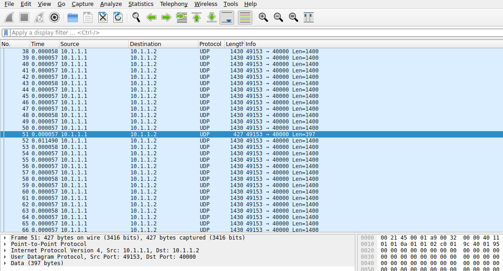
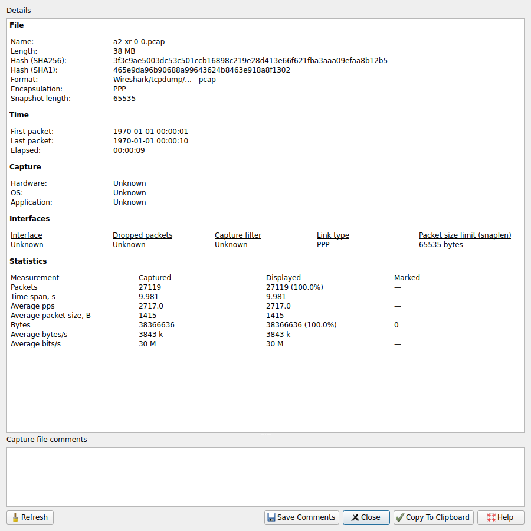
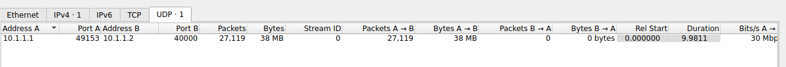
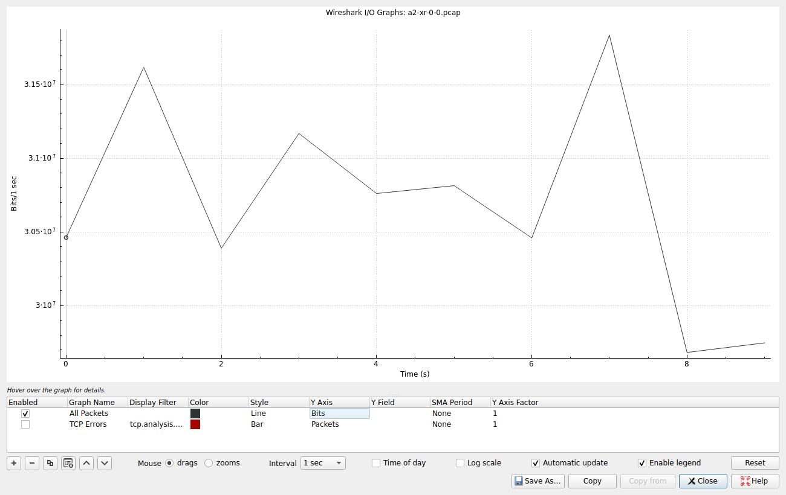
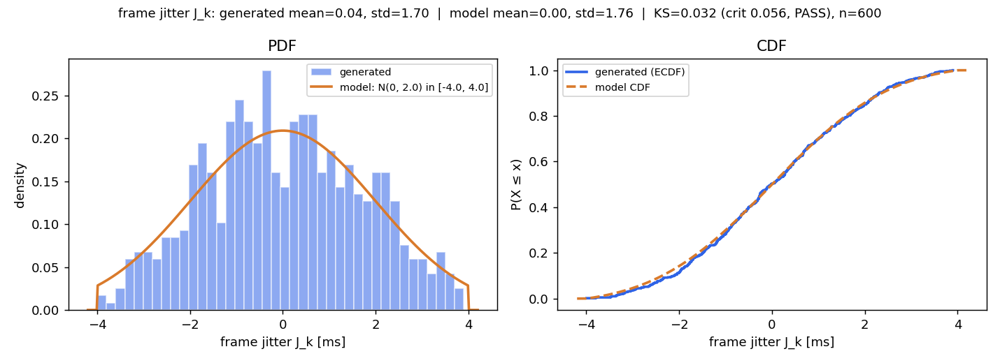

# A2 — ns-3 in Docker, from Zero to a Verified 3GPP Traffic Model

**Goal:** get ns-3 running, generate traffic with the 3GPP XR traffic model referenced by TR 26.926, and prove it with your own run: a throughput/delay number, a PCAP opened in Wireshark, and the PDF/CDF of the packet size and inter-arrival time you generated.

This guide assumes you have **never installed Docker**. Every command below was run end-to-end on a real machine; the numbers and screenshots in this document come from that run (see [Reference run](#reference-run)).

Every file used here is in the [`a2/`](a2/) folder:

| File | Purpose |
|---|---|
| [`a2/Dockerfile`](a2/Dockerfile) | Ubuntu 24.04 image with the ns-3 toolchain, `tshark`, and Python plotting |
| [`a2/xr-traffic.cc`](a2/xr-traffic.cc) | ns-3 program: 3GPP XR video traffic generator + PCAP + FlowMonitor + PDB check |
| [`a2/plot_dist.py`](a2/plot_dist.py) | PDF/CDF of frame size, jitter, inter-arrival and packet size vs the model, with KS tests |

The task maps to the steps like this:

| Task | Steps |
|---|---|
| Install and build ns-3; document version, platform, breakages | 0–3, 8 |
| Study TS 26.926; generate packets with the traffic model | 4–5 |
| Show your own result (throughput/delay, PCAP in Wireshark) | 5–6 |
| Verify the model (PDF/CDF of packet size and inter-arrival) | 7 |

---

## 0. Check disk space first

Docker stores images in `/var/lib/docker` on your **system** disk. You need about **3 GB free** there (1.1 GB image + headroom) and about **1 GB** wherever you keep your work folder.

```bash
df -h / ~
docker system df        # once Docker is installed: what Docker already uses
```

If `/` is nearly full, free space before you start — `docker build` fails halfway otherwise. `docker system df` shows how much is reclaimable; remove images you no longer need with `docker rmi <image>`.

---

## 1. Install Docker

Docker runs ns-3 inside a *container*: a small, isolated Linux with exactly the packages ns-3 needs. You install the toolchain once and never fight host dependency conflicts.

### Linux (Ubuntu / Debian)

```bash
# 1. Install Docker Engine with the official convenience script
curl -fsSL https://get.docker.com -o get-docker.sh
sudo sh get-docker.sh

# 2. Let your user run docker without sudo
sudo usermod -aG docker $USER
newgrp docker          # or log out and back in

# 3. Check it works
docker --version
docker run hello-world
```

`hello-world` should print *"Hello from Docker!"*. If you see `permission denied ... docker.sock`, step 2 hasn't taken effect yet — log out and log back in.

### Windows / macOS

Install **Docker Desktop** from <https://www.docker.com/products/docker-desktop/>, start it, then open a terminal and run `docker run hello-world`. On Windows, let the installer enable **WSL 2**, and run every command below from a WSL (Ubuntu) terminal.

---

## 2. Build the ns-3 lab image

The image holds the **tools** (compiler, CMake, `tshark`, Python). ns-3's **source** is cloned into a folder on your host and mounted into the container, so your code and results survive after the container exits and you can edit them with your normal editor.

```bash
# from the repo root (the folder that contains a2/)
docker build -t ns3lab a2/
```

This took **3 minutes** in the reference run and produces a 1.1 GB image. Later builds are cached.

Create a work folder on the host and start a container with it mounted at `/work`:

```bash
mkdir -p ~/ns3-work
cp a2/xr-traffic.cc a2/plot_dist.py ~/ns3-work/

docker run -it --name ns3 -v ~/ns3-work:/work ns3lab
```

You're now at a shell **inside** the container (`root@...:/work#`). Anything you write under `/work` appears in `~/ns3-work` on the host.

To come back later:

```bash
docker start -ai ns3
```

---

## 3. Get and build ns-3

Inside the container:

```bash
cd /work
git clone https://gitlab.com/nsnam/ns-3-dev.git
cd ns-3-dev

# pin a release so your result is reproducible
git tag --list 'ns-3.*' | sort -V | tail -5   # newest release tags
git checkout ns-3.48                           # newest as of Sep 2026; use the newest tag you see

./ns3 configure --build-profile=optimized --enable-examples --enable-tests
./ns3 build
```

The build compiles about 2 000 targets: **21 minutes on 20 cores** in the reference run; expect 40+ minutes on a 4-core laptop. If the compiler gets killed (`c++: fatal error: Killed signal terminated program`), it ran out of RAM — limit parallel jobs with `./ns3 build -j2`.

`./ns3 configure` ends with a module list. `brite`, `click`, `mpi`, `openflow` and `visualizer` under *"Modules that cannot be built"* is normal: they need optional libraries this guide doesn't use.

**Smoke test:**

```bash
./test.py --suite=udp
```

Expected: `PASS: TestSuite udp` and `1 of 1 tests passed`.

> **Why not `./ns3 run first`?** The `optimized` profile compiles logging out (`NS3_LOG=OFF`), and `first` prints only through logging — so it runs correctly but prints nothing. If you want to see its `Received 1024 bytes` lines, configure with `--build-profile=default` instead (slower simulations, logging on).

**Record your environment** (paste this into your report):

```bash
git config --global --add safe.directory /work/ns-3-dev   # see "What broke"
git describe --tags                    # ns-3 version
grep PRETTY /etc/os-release            # container OS
g++ --version | head -1
cmake --version | head -1
python3 --version
```

On the host, also record `docker --version`, `lsb_release -ds` and `uname -r`.

---

## 4. The 3GPP traffic model

### Where the model comes from

The course says *TS* 26.926; the document is published as a Technical **Report**: **3GPP TR 26.926 V19.0.0** (Release 19), *Traffic Models and Quality Evaluation Methods for Media and XR Services in 5G Systems*, also published as **ETSI TR 126 926 V19.0.0 (2026-02)**. The 3GPP portal blocks scripted downloads; the ETSI copy is a direct PDF: <https://www.etsi.org/deliver/etsi_tr/126900_126999/126926/19.00.00_60/tr_126926v190000p.pdf>.

The clauses this program implements:

| Clause of TR 26.926 V19.0.0 | What it specifies |
|---|---|
| **6.4** Recommended Configurations (XR split rendering) | 2 eye buffers at 60 fps; HEVC at **30 or 45 Mbit/s**, split equally across eye buffers |
| **6.5.3.1** Frame Size, **Table 6.5.3.1-1** | frame size is a **truncated Gaussian**: STD = **10.5 %** of the mean, **Min 50 %**, **Max 150 %** of the mean (optional: 4 %, 88 %, 112 %). The table is TR 38.838 Table 5.1.1.5-1, repeated |
| **6.5.3.2** Jitter | *"The jitter is modelled as a random variable added on top of periodic arrivals, which follows truncated Gaussian distribution"*, per TR 38.838 |
| **5.7.2** Content Delivery Modelling for ADU Fragmentation | frames (application data units) are fragmented into IP packets for delivery |

TR 26.926 defers the jitter *parameters* to **3GPP TR 38.838** (XR evaluations for NR). TR 38.838 isn't published by ETSI and the 3GPP portal refused scripted downloads, so the values below were taken from Table I of Gapeyenko et al., *"Standardization of Extended Reality (XR) over 5G and 5G-Advanced 3GPP New Radio"* (Nokia, [arXiv:2203.02242](https://arxiv.org/abs/2203.02242)), which reproduces the TR 38.838 DL video model: jitter mean **0 ms**, STD **2 ms**, range **[−4, 4] ms** (optional [−5, 5]); packet delay budget (PDB) **10 ms** for VR, 15 ms for cloud gaming. If you can open TR 38.838 itself, cite it directly.

### The model, as implemented

This is the **TR 38.838 single-stream DL video baseline**: one frame per period carries both eyes (Gapeyenko et al.: *"the packet also includes the data for both left and right eyes"*).

| Quantity | Model | Default |
|---|---|---|
| Frame rate F | fixed | 60 fps → period T = 16.67 ms |
| Frame arrival | `t_k = t₀ + k·T + J_k` — jitter on top of the periodic schedule, **not** accumulated | — |
| Jitter J_k | truncated Gaussian, mean 0, STD 2 ms, \|J_k\| ≤ 4 ms | — |
| Frame size | truncated Gaussian, mean M = R·10⁶ / (F·8) bytes, STD 10.5 % of M, in [50 %, 150 %] of M | R = 30 Mbit/s → M = **62 500 B** |
| Packetization | each frame split into UDP packets of ≤ 1400 B payload | IP packet ≤ 1428 B < 1500 B MTU |
| PDB check | count packets with one-way delay ≥ PDB | 10 ms (VR) |

With the defaults a frame is 31 250–93 750 B and becomes about **45 packets**: 44 full 1400 B packets plus one shorter remainder.

Because jitter is added to a *fixed* schedule, the frame inter-arrival time is `T + J_k − J_(k−1)`: mean 16.67 ms, but its spread is √2 times the jitter's (≈ 2.5 ms, not 2 ms). Step 7 checks the jitter and the inter-arrival separately for exactly this reason.

**Dual-eye-buffer variant.** Table 6.5.3.1-1 is titled *"dual eye buffer frame size"*: mean M = R·10⁶ / (2F) / 8, one frame per eye. To model one eye buffer, run with half the bitrate, e.g. `--dataRateMbps=15` for a 30 Mbit/s stream (M = 31 250 B); the other eye is an independent, identical stream.

**Two levels, two things to verify.** The 3GPP model is defined at the **frame** level (size and arrival time). Packet sizes are a *consequence* of cutting frames into 1400 B pieces: almost every packet is exactly 1400 B, and one packet per frame carries the remainder. Step 7 checks both.

### Using AI to generate the model

The task allows AI-generated traffic models. `xr-traffic.cc` is one: it was generated with an AI assistant, then run, compared against the spec text, and corrected three times — see rows 6–8 of [What broke](#8-what-broke-and-fixes). Two of those errors (wrong truncation, wrong jitter structure) were invisible in the plots and only found by **reading the clauses above**. If you generate your own variant, keep three rules: (1) take the model and its parameters from the spec, not from the AI; (2) check that what the network carries matches what the generator logged (step 7, PCAP cross-check); (3) verify the output distributions against the model.

---

## 5. Run the traffic generator

Inside the container, in `/work/ns-3-dev`:

```bash
cp /work/xr-traffic.cc scratch/
./ns3 run xr-traffic
```

ns-3 compiles any `.cc` in `scratch/` automatically (the first run also re-runs `configure`, so you'll see the module list again). The topology is two nodes on a 200 Mbps / 5 ms point-to-point link: node 0 generates XR frames and sends them over UDP to a sink on node 1, port 40000. The periodic schedule starts at t₀ = 1 s and runs for 600 frames (10 s).

Output of the reference run:

```
Generated  : 600 frames, 37553066 bytes (30.0425 Mbps offered)
Send fails : 0
Flow 1  10.1.1.1 -> 10.1.1.2
  Tx packets : 27119
  Rx packets : 27119
  Lost       : 0
  Rx bytes   : 38312398
  Throughput : 30.6924 Mbps (IP layer, incl. headers)
  Mean delay : 6.33436 ms
  Over PDB   : 0 packets with delay >= 10 ms
```

How to read it:

- **Send fails must be 0.** Anything else means packets never entered the network.
- **Offered 30.04 Mbps** matches the 30 Mbit/s target.
- **Throughput 30.69 Mbps** is measured at the IP layer, so it includes the 28-byte IP+UDP header on each of the 27 119 packets: 37 553 066 + 27 119 × 28 = 38 312 398 bytes, exactly the `Rx bytes` line.
- **Mean delay 6.33 ms** = 5 ms propagation + serialization + queueing behind the other packets of the same frame (a frame's ~45 packets leave back-to-back, 57 µs apart at 200 Mbps).
- **Over PDB 0** — every packet arrived within the 10 ms VR packet delay budget. Try a slower link (`DataRate` in the code) to see this number grow.

The run writes these files in `ns-3-dev/`:

| File | Content |
|---|---|
| `xr-frames.csv` | one row per frame: id, nominal slot time, actual send time, jitter J_k, frame size, packet count, inter-arrival |
| `xr-packets.csv` | one row per packet: send time, frame id, size |
| `a2-xr-0-0.pcap` | capture at the sender (node 0) |
| `a2-xr-1-0.pcap` | capture at the receiver (node 1) |

The first frame of the reference run, from `xr-frames.csv`: nominal slot 1.000 s, jitter +2.51 ms, sent at 1.00251 s, **70 397 bytes in 51 packets** — you'll find exactly this frame in Wireshark below.

**Change parameters without recompiling:**

```bash
./ns3 run "xr-traffic --dataRateMbps=45 --jitterBndMs=5 --seed=2"
./ns3 run "xr-traffic --PrintHelp"      # list every option
```

Use a different `--seed` for each independent run you report. With the same seed, a run reproduces exactly.

---

## 6. Open the PCAP in Wireshark

Files written by the container are owned by `root` on the host. Hand them back to your user first, from inside the container:

```bash
chown -R 1000:1000 /work          # 1000 = your host user id; check with `id -u` on the host
```

The PCAP lives in `~/ns3-work/ns-3-dev/` on the host, so open it with Wireshark **on the host**:

```bash
# host, Ubuntu
sudo apt install wireshark
wireshark ~/ns3-work/ns-3-dev/a2-xr-0-0.pcap
```

The four views below are from the reference run (Wireshark 4.2.2).

**1. Packet list** — *View → Time Display Format → Seconds Since Previous Displayed Packet* (Ctrl+Alt+6), then *Go → Go to Packet* 51 (Ctrl+G). Packets 1–50 are 1400 B, 57 µs apart; **packet 51 is the 397 B remainder** — 50 × 1400 + 397 = 70 397 B, the first frame from `xr-frames.csv`; **packet 52 comes 11.49 ms later** and starts the next frame.



**2. Statistics → Capture File Properties** — 27 119 packets over 9.981 s, 30 Mbit/s on average. The SHA256 hash identifies this exact capture file.



**3. Statistics → Conversations → UDP tab** — a single flow, 10.1.1.1:49153 → 10.1.1.2:40000: 27 119 packets, 38 MB, 9.98 s, 30 Mbps.



**4. Statistics → I/O Graphs** — Y axis of *All Packets* set to **Bits** (double-click the *Y Axis* cell), *TCP Errors* unchecked, interval 1 s. The rate stays between 29.7 and 31.8 Mbit/s (per-second counts from `tshark -q -z io,stat,1`). Note the Y axis is **auto-scaled and does not start at 0**, which exaggerates the swings: they are only −1 % to +6 % around 30 Mbit/s, caused by the random frame sizes (each 1 s bin holds just ~60 frames).



No Wireshark? Use `tshark` inside the container:

```bash
tshark -r a2-xr-0-0.pcap -c 5
capinfos -c -d -u -i a2-xr-0-0.pcap      # count, size, duration, data rate
```

### How these screenshots were made (headless)

The reference machine had no display available to the session, so the real Wireshark GUI was run inside the container on a virtual X display and photographed. You don't need this if you have a desktop, but it's reproducible:

```bash
# inside the container
apt-get update && apt-get install -y --no-install-recommends wireshark xvfb imagemagick xdotool
Xvfb :99 -screen 0 1600x1000x24 &
export DISPLAY=:99
wireshark -r a2-xr-0-0.pcap &
sleep 10
w=$(xdotool search --name 'a2-xr-0-0.pcap' | tail -1)
xdotool windowsize $w 1560 960
import -window $w packet-list.png          # screenshot one window
```

Menus are driven with `xdotool key` / `xdotool mousemove X Y click 1`. Stop the GUI with `kill <pid>` (not `pkill -f wireshark` — see [What broke](#8-what-broke-and-fixes)).

---

## 7. Verify the traffic model (PDF and CDF)

Inside the container, in `/work/ns-3-dev`:

```bash
cp /work/plot_dist.py .
python3 plot_dist.py
```

It prints the generated mean and standard deviation next to the model, runs a Kolmogorov–Smirnov (KS) test, and writes four figures:

| Figure | Generated data | Model |
|---|---|---|
| `dist_frame_size.png` | frame sizes | truncated Gaussian N(62 500, 6 563) in [31 250, 93 750] B |
| `dist_frame_jitter.png` | J_k = actual send time − nominal slot | truncated Gaussian N(0, 2) in [−4, 4] ms |
| `dist_frame_iat.png` | frame inter-arrival times | T + J_k − J_(k−1), computed by Monte Carlo from the jitter model |
| `dist_packet.png` | packet sizes; packet inter-departure times | frame model fragmented into 1400 B packets (Monte Carlo) |

Reference-run output:

```
dist_frame_size.png: generated mean=62588.443 std=6541.690 B | model mean=62500.000 std=6562.351 B | KS=0.0300 crit=0.0555 -> PASS
dist_frame_jitter.png: generated mean=0.043 std=1.696 ms | model mean=0.000 std=1.759 ms | KS=0.0317 crit=0.0555 -> PASS
dist_frame_iat.png: generated mean=16.659 std=2.417 ms | model mean=16.667 std=2.495 ms | KS=0.0272 crit=0.0556 -> PASS
dist_packet.png: 27119 packets, 45.20/frame, full-size share generated 97.788% vs model 97.787%
```

**How to judge the fit:**

- **KS test.** The KS distance is the largest vertical gap between the generated CDF and the model CDF. Below the critical value (≈ 1.36/√n, 0.0555 for 600 frames) the generated data is consistent with the model at the 5 % level. All three frame-level checks pass.
- **Mean and std.** Compare against the *truncated* model values the script prints, not the nominal σ. Truncating the jitter at ±2σ shrinks its std from 2 ms to 1.76 ms. The frame size is cut at ±4.76σ, so its std barely changes (6 562 B). With 600 samples, a few percent of difference is normal sampling noise.
- **Packet level.** The packet-size PDF is a spike at 1400 B (97.8 % of packets) plus a flat floor from the remainder packets. The model predicts 97.787 % full packets; the run produced 97.788 %. At the application, 97.8 % of packet gaps are 0 ms (a frame's packets are handed over together); the rest are the frame gaps.

If you passed different parameters to the simulation, pass the same ones to the plot so the model curves match:

```bash
python3 plot_dist.py --rate 45 --jitter-bound 5
```

**Cross-check against the wire.** The CSV is what the generator *says* it sent; the PCAP is what the network *carried*. They must agree:

```bash
tshark -r a2-xr-0-0.pcap -T fields -e udp.length \
  | awk '{n++; s+=$1-8} END {print "pcap:", n, "packets,", s, "payload bytes"}'
awk -F, 'NR>1 {n++; s+=$3} END {print "csv :", n, "packets,", s, "payload bytes"}' xr-packets.csv
```

Both must print the same packet count and byte total — 27 119 packets and 37 553 066 bytes in the reference run. (`udp.length` includes the 8-byte UDP header, hence the `-8`.)

Copy the figures back to the repo for your submission (on the host):

```bash
mkdir -p assets/img/a2
cp ~/ns3-work/ns-3-dev/dist_*.png assets/img/a2/
```

---

## 8. What broke (and fixes)

The task asks for anything that broke. All of these happened in the reference run or while writing this guide:

| # | Symptom | Cause | Fix |
|---|---|---|---|
| 1 | `docker build` can't start / *no space left on device* | `/` was 100 % full (398 MB free); Docker writes to `/var/lib/docker` there | removed two unused 19-month-old images with `docker rmi` (freed ~20 GB); check `docker system df` |
| 2 | `docker build` stalls at a "Configuring wireshark-common" prompt | tshark asks an interactive question | the `debconf-set-selections` line in the Dockerfile answers it; don't remove it |
| 3 | `./ns3 run first` prints nothing | `optimized` profile compiles logging out | use `./test.py --suite=udp` as the smoke test, or configure `--build-profile=default` |
| 4 | `./test.py --suite=core-test-suite`: *unknown test suite name* | no suite by that name in ns-3.48 | list suites with `./test.py --list`; `udp` works |
| 5 | Wireshark shows packets as **TAPA**, not UDP | UDP port 5000 is claimed by a Wireshark dissector | use port 40000 (current code), or *Analyze → Decode As… → UDP* |
| 6 | Only 407 of 600 frames delivered, 19 Mbps instead of 30 — while the CSV still said 600 | first draft sent each frame as one UDP datagram; frames > 65 507 B fail `Send()` **silently** | fragment frames into ≤ 1400 B packets and count `Send()` failures |
| 7 | Frame sizes never below 42 800 B or above 82 200 B | first draft truncated at mean ± 3σ; the spec says Min 50 %, Max 150 % of the mean (Table 6.5.3.1-1) | truncate at [50 %, 150 %]; found only by reading the spec — the plots passed the KS test against the wrong model |
| 8 | Jitter behaved like a random walk (inter-arrival std 1.76 ms instead of ~2.5 ms) | first draft added jitter to the *inter-arrival* (`t_(k+1) = t_k + T + J`); the spec adds it *on top of periodic arrivals* (clause 6.5.3.2) | schedule frame k at `t₀ + k·T + J_k` (current code) |
| 9 | Model CDF in the first plots never reached 1 | overlay used an untruncated Gaussian | overlay the truncated Gaussian (current `plot_dist.py`) |
| 10 | `fatal: detected dubious ownership in repository` | after `chown` to your user, git in the root container distrusts the repo | `git config --global --add safe.directory /work/ns-3-dev` |
| 11 | Wireshark can't open the pcap / files are locked on the host | files written by the container are owned by root | `chown -R 1000:1000 /work` inside the container |
| 12 | `apt-get install wireshark-qt`: *no installation candidate* | Ubuntu 24.04 ships the Qt GUI as package `wireshark` | `apt-get install wireshark` |
| 13 | `pkill -f wireshark` killed the shell running it | `-f` matches the shell's own command line, which contains "wireshark" | `kill <pid>` from `ps` |
| 14 | 3GPP portal returns HTTP 403 to `curl` | bot protection on 3gpp.org | download the ETSI copy (ETSI TR 126 926) instead |
| 15 | `c++: fatal error: Killed signal terminated program cc1plus` | compiler ran out of RAM (not hit here; common on laptops) | `./ns3 build -j2` (or `-j1`), or give Docker Desktop more memory |

---

## Reference run

| Item | Value |
|---|---|
| Host | Ubuntu 22.04.5 LTS, kernel 6.8.0-138-generic, 20 CPU cores, 31 GB RAM |
| Docker | 28.3.0 |
| Container | Ubuntu 24.04.5 LTS |
| ns-3 | ns-3.48, `optimized` profile, examples + tests enabled |
| Toolchain | g++ 13.3.0, CMake 3.28.3, Python 3.12.3, TShark / Wireshark 4.2.2 |
| Time | image build 3 min; ns-3 build 21 min |
| Spec | 3GPP TR 26.926 V19.0.0 (ETSI TR 126 926 V19.0.0, 2026-02), clauses 5.7.2, 6.4, 6.5.3.1, 6.5.3.2; jitter parameters from TR 38.838 via Gapeyenko et al. |
| Traffic | 30 Mbit/s, 60 fps, 600 frames, seed 1 |
| Result | 30.04 Mbps offered, 27 119 packets, 0 lost, 30.69 Mbps IP-layer throughput, 6.33 ms mean delay, 0 packets over the 10 ms PDB |
| Model check | frame size KS 0.030, jitter KS 0.032, frame inter-arrival KS 0.027 — all PASS; full-size packets 97.788 % vs 97.787 % predicted |
| Wire check | PCAP and CSV both 27 119 packets, 37 553 066 payload bytes |





---

## Deliverables checklist

- [x] Docker + ns-3 installed; `./test.py --suite=udp` passes.
- [x] Environment recorded: ns-3 tag, container OS, g++/CMake/Python versions, Docker version, host OS.
- [x] Breakages hit and how they were fixed.
- [x] Spec clauses cited; parameter values used.
- [x] Program output: 0 send failures, throughput, mean delay, PDB check.
- [x] Wireshark screenshots of `a2-xr-0-0.pcap`.
- [x] PCAP vs CSV cross-check (same packet count and bytes).
- [x] `dist_frame_size.png`, `dist_frame_jitter.png`, `dist_frame_iat.png`, `dist_packet.png` with KS results.
