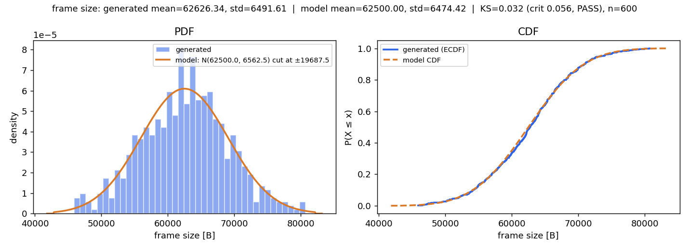
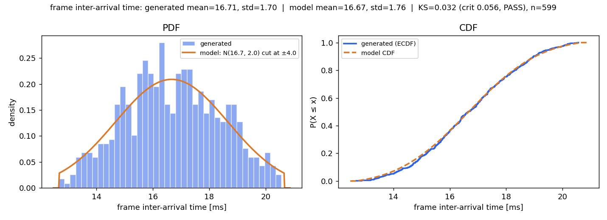
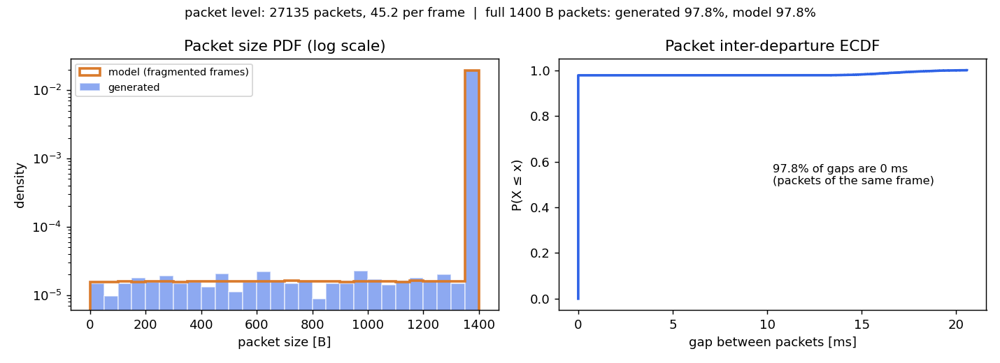

# A2 — ns-3 in Docker, from Zero to a Verified 3GPP Traffic Model

**Goal:** get ns-3 running, generate traffic with a 3GPP TS 26.926-style model, and prove it with your own run: a throughput/delay number, a PCAP opened in Wireshark, and the PDF/CDF of the packet size and inter-arrival time you generated.

This guide assumes you have **never installed Docker**. Every command below was run end-to-end on a real machine; the numbers in the [reference run](#reference-run) are from that run.

Every file used here is in the [`a2/`](a2/) folder:

| File | Purpose |
|---|---|
| [`a2/Dockerfile`](a2/Dockerfile) | Ubuntu 24.04 image with the ns-3 toolchain, `tshark`, and Python plotting |
| [`a2/xr-traffic.cc`](a2/xr-traffic.cc) | ns-3 program: 3GPP-style XR video traffic generator + PCAP + FlowMonitor |
| [`a2/plot_dist.py`](a2/plot_dist.py) | PDF/CDF of frame size, frame inter-arrival, and packet size vs the model, with a KS test |

The task maps to the steps like this:

| Task | Steps |
|---|---|
| Install and build ns-3; document version, platform, breakages | 1–3, 8 |
| Study TS 26.926; generate packets with the traffic model | 4–5 |
| Show your own result (throughput/delay, PCAP in Wireshark) | 5–6 |
| Verify the model (PDF/CDF of packet size and inter-arrival) | 7 |

---

## 0. Check disk space first

Docker stores images in `/var/lib/docker` on your **system** disk. You need about **3 GB free** there (1.1 GB image + headroom) and about **1 GB** wherever you keep your work folder.

```bash
df -h / ~
docker system df        # once Docker is installed: what Docker already uses
```

If `/` is nearly full, free space before you start — `docker build` fails halfway otherwise. `docker system df` shows how much is reclaimable; remove images you no longer need with `docker rmi <image>`.

---

## 1. Install Docker

Docker runs ns-3 inside a *container*: a small, isolated Linux with exactly the packages ns-3 needs. You install the toolchain once and never fight host dependency conflicts.

### Linux (Ubuntu / Debian)

```bash
# 1. Install Docker Engine with the official convenience script
curl -fsSL https://get.docker.com -o get-docker.sh
sudo sh get-docker.sh

# 2. Let your user run docker without sudo
sudo usermod -aG docker $USER
newgrp docker          # or log out and back in

# 3. Check it works
docker --version
docker run hello-world
```

`hello-world` should print *"Hello from Docker!"*. If you see `permission denied ... docker.sock`, step 2 hasn't taken effect yet — log out and log back in.

### Windows / macOS

Install **Docker Desktop** from <https://www.docker.com/products/docker-desktop/>, start it, then open a terminal and run `docker run hello-world`. On Windows, let the installer enable **WSL 2**, and run every command below from a WSL (Ubuntu) terminal.

---

## 2. Build the ns-3 lab image

The image holds the **tools** (compiler, CMake, `tshark`, Python). ns-3's **source** is cloned into a folder on your host and mounted into the container, so your code and results survive after the container exits and you can edit them with your normal editor.

```bash
# from the repo root (the folder that contains a2/)
docker build -t ns3lab a2/
```

This took **3 minutes** in the reference run and produces a 1.1 GB image. Later builds are cached.

Create a work folder on the host and start a container with it mounted at `/work`:

```bash
mkdir -p ~/ns3-work
cp a2/xr-traffic.cc a2/plot_dist.py ~/ns3-work/

docker run -it --name ns3 -v ~/ns3-work:/work ns3lab
```

You're now at a shell **inside** the container (`root@...:/work#`). Anything you write under `/work` appears in `~/ns3-work` on the host.

To come back later:

```bash
docker start -ai ns3
```

---

## 3. Get and build ns-3

Inside the container:

```bash
cd /work
git clone https://gitlab.com/nsnam/ns-3-dev.git
cd ns-3-dev

# pin a release so your result is reproducible
git tag --list 'ns-3.*' | sort -V | tail -5   # newest release tags
git checkout ns-3.48                           # newest as of Sep 2026; use the newest tag you see

./ns3 configure --build-profile=optimized --enable-examples --enable-tests
./ns3 build
```

The build compiles about 2 000 targets: **21 minutes on 20 cores** in the reference run; expect 40+ minutes on a 4-core laptop. If the compiler gets killed (`c++: fatal error: Killed signal terminated program`), it ran out of RAM — limit parallel jobs with `./ns3 build -j2`.

`./ns3 configure` ends with a module list. `brite`, `click`, `mpi`, `openflow` and `visualizer` under *"Modules that cannot be built"* is normal: they need optional libraries this guide doesn't use.

**Smoke test:**

```bash
./test.py --suite=udp
```

Expected: `PASS: TestSuite udp` and `1 of 1 tests passed`.

> **Why not `./ns3 run first`?** The `optimized` profile compiles logging out (`NS3_LOG=OFF`), and `first` prints only through logging — so it runs correctly but prints nothing. If you want to see its `Received 1024 bytes` lines, configure with `--build-profile=default` instead (slower simulations, logging on).

**Record your environment** (paste this into your report):

```bash
git config --global --add safe.directory /work/ns-3-dev   # see "What broke"
git describe --tags                    # ns-3 version
grep PRETTY /etc/os-release            # container OS
g++ --version | head -1
cmake --version | head -1
python3 --version
```

On the host, also record `docker --version`, `lsb_release -ds` and `uname -r`.

---

## 4. The 3GPP traffic model (TS 26.926)

**3GPP TS 26.926** — *Traffic Models and Quality Evaluation Methods for Media and XR Services in 5G Systems* — gives statistical models for real-time media (XR split rendering, cloud gaming, conversational video). Download it from the 3GPP portal (<https://www.3gpp.org/dynareport/26926.htm>) and read the clause for the service you pick. The RAN-side counterpart, **3GPP TR 38.838** (XR evaluations for NR), uses the same frame-based structure and is useful for cross-checking parameter values.

The common structure is **frame-based**: an encoder emits one video frame per frame period, each frame has a random size around the target bitrate, frames reach the network with random jitter, and each frame is split into MTU-sized IP packets.

This tutorial encodes that structure as follows:

| Quantity | Model | Default |
|---|---|---|
| Frame rate | fixed `fps` | 60 fps |
| Frame inter-arrival | `1/fps + J`, J ~ truncated Normal(0, σ_J), \|J\| ≤ 4 ms | σ_J = 2 ms |
| Frame size | truncated Normal(μ_S, σ_S), cut at μ_S ± 3σ_S | μ_S = R / fps / 8 bytes |
| Frame-size spread | σ_S = 10.5 % of μ_S | — |
| Target bitrate | R | 30 Mbps |
| Packetization | each frame split into UDP packets of ≤ 1400 B payload | IP packet ≤ 1428 B < 1500 B MTU |

With the defaults, μ_S = 30·10⁶ / 60 / 8 = **62 500 bytes** and σ_S ≈ **6 563 bytes**, so a frame becomes about **45 packets**: 44 full 1400 B packets plus one shorter remainder.

> **Check the numbers against the spec.** The defaults above (60 fps, 10.5 % size spread, 2 ms jitter truncated at ±4 ms) are the values commonly used in the 3GPP XR evaluation methodology. Before you submit, look up the exact clause in TS 26.926 for your chosen service and pass its values on the command line (step 5). Cite the clause number in your report.

**Two levels, two things to verify.** The 3GPP model is defined at the **frame** level (size and arrival time). Packet sizes are a *consequence* of cutting frames into 1400 B pieces: almost every packet is exactly 1400 B, and one packet per frame carries the remainder. Step 7 checks both.

> **Why frames are fragmented.** An earlier draft of this program sent each frame as a single UDP datagram to keep "packet size = frame size". That's wrong at 30 Mbps: a UDP datagram can't exceed 65 507 B, but about a third of frames are bigger than that (the model reaches +3σ ≈ 82 000 B). Those sends failed *silently* — the run delivered 19 Mbps instead of 30, while the generator's own log still claimed 600 frames. The program now fragments frames, checks every `Send()` return value, and prints the failure count. Keep that check if you modify it.

### Using AI to generate the model

The task allows AI-generated traffic models. `xr-traffic.cc` is one: it was generated with an AI assistant from the model description above, then run, debugged (the fragmentation bug above) and checked by hand. If you generate your own variant, keep three rules: (1) take the parameters from the spec, not from the AI; (2) check that what the network carries matches what the generator logged (step 7, PCAP cross-check); (3) verify the output distributions — that plot is your proof the code does what the spec says.

---

## 5. Run the traffic generator

Inside the container, in `/work/ns-3-dev`:

```bash
cp /work/xr-traffic.cc scratch/
./ns3 run xr-traffic
```

ns-3 compiles any `.cc` in `scratch/` automatically (the first run also re-runs `configure`, so you'll see the module list again). The topology is two nodes on a 200 Mbps / 5 ms point-to-point link: node 0 generates XR frames and sends them over UDP to a sink on node 1, port 40000. The generator starts at t = 1 s and emits 600 frames (10 s).

Output of the reference run:

```
Generated  : 600 frames, 37575805 bytes (30.0606 Mbps offered)
Send fails : 0
Flow 1  10.1.1.1 -> 10.1.1.2
  Tx packets : 27135
  Rx packets : 27135
  Lost       : 0
  Rx bytes   : 38335585
  Throughput : 30.6108 Mbps (IP layer, incl. headers)
  Mean delay : 6.3349 ms
```

How to read it:

- **Send fails must be 0.** Anything else means packets never entered the network.
- **Offered 30.06 Mbps** matches the 30 Mbps target.
- **Throughput 30.6 Mbps** is measured at the IP layer, so it includes the 28-byte IP+UDP header on each of the 27 135 packets: 37 575 805 + 27 135 × 28 = 38 335 585 bytes, exactly the `Rx bytes` line.
- **Mean delay 6.33 ms** = 5 ms propagation + serialization + queueing behind the other packets of the same frame (a frame's ~45 packets leave back-to-back, 57 µs apart at 200 Mbps).

The run writes these files in `ns-3-dev/`:

| File | Content |
|---|---|
| `xr-frames.csv` | one row per frame: id, send time, frame size, packet count, inter-arrival time |
| `xr-packets.csv` | one row per packet: send time, frame id, size |
| `a2-xr-0-0.pcap` | capture at the sender (node 0) |
| `a2-xr-1-0.pcap` | capture at the receiver (node 1) |

**Change parameters without recompiling:**

```bash
./ns3 run "xr-traffic --dataRateMbps=45 --fps=90 --jitterStdMs=1.5 --seed=2"
./ns3 run "xr-traffic --PrintHelp"      # list every option
```

Use a different `--seed` for each independent run you report. With the same seed, a run reproduces exactly.

---

## 6. Open the PCAP in Wireshark

Files written by the container are owned by `root` on the host. Hand them back to your user first, from inside the container:

```bash
chown -R 1000:1000 /work          # 1000 = your host user id; check with `id -u` on the host
```

The PCAP lives in `~/ns3-work/ns-3-dev/` on the host, so open it with Wireshark **on the host** (no GUI needed in the container):

```bash
# host, Ubuntu
sudo apt install wireshark
wireshark ~/ns3-work/ns-3-dev/a2-xr-0-0.pcap
```

What to show in your report (take screenshots):

1. **Packet list** — lines like `10.1.1.1 → 10.1.1.2  UDP  1430  49153 → 40000 Len=1400`. Runs of 1400-byte packets 57 µs apart (one frame), a shorter remainder packet, then a ~16.7 ms gap before the next frame.
2. **Statistics → Capture File Properties** — 27 135 packets, 10.01 s, ~30 Mbps average bit rate.
3. **Statistics → I/O Graphs** — set the interval to 100 ms and the Y axis to bits; you'll see a steady ~3 Mbit per 100 ms.
4. **Statistics → Conversations → UDP** — one conversation, 49153 ↔ 40000, with its bytes and duration.

No Wireshark? Use `tshark` inside the container:

```bash
tshark -r a2-xr-0-0.pcap -c 5
capinfos -c -d -u -i a2-xr-0-0.pcap      # count, size, duration, data rate
```

---

## 7. Verify the traffic model (PDF and CDF)

Inside the container, in `/work/ns-3-dev`:

```bash
cp /work/plot_dist.py .
python3 plot_dist.py
```

It prints the generated mean and standard deviation next to the model, runs a Kolmogorov–Smirnov (KS) test, and writes three figures:

| Figure | What it shows |
|---|---|
| `dist_frame_size.png` | frame-size PDF and CDF vs the model: Normal(62 500 B, 6 563 B) truncated at ±3σ |
| `dist_frame_iat.png` | frame inter-arrival PDF and CDF vs the model: Normal(16.67 ms, 2 ms) truncated at ±4 ms |
| `dist_packet.png` | packet-size PDF vs the size distribution the frame model predicts after fragmentation, and the packet inter-departure CDF |

Reference-run output:

```
dist_frame_size.png: generated mean=62626.342 std=6491.606 B | model mean=62500.000 std=6474.421 B | KS=0.0316 crit=0.0555 -> PASS
dist_frame_iat.png: generated mean=16.713 std=1.696 ms | model mean=16.667 std=1.759 ms | KS=0.0316 crit=0.0556 -> PASS
dist_packet.png: 27135 packets, 45.23/frame, full-size share generated 97.789% vs model 97.786%
```

**How to judge the fit:**

- **KS test.** The KS distance is the largest vertical gap between the generated CDF and the model CDF. Below the critical value (≈ 1.36/√n, 0.0555 for 600 frames) the generated data is consistent with the model at the 5 % level. Both frame-level checks pass.
- **Mean and std.** Compare against the *truncated* model values the script prints, not the nominal σ. Cutting the tails shrinks the std: 2 ms nominal jitter becomes 1.76 ms after truncation at ±2σ. With 600 samples, a few percent of difference is normal sampling noise.
- **Packet level.** The packet-size PDF is a spike at 1400 B (97.8 % of packets) plus a flat floor from the remainder packets. The model predicts 97.786 % full packets; the run produced 97.789 %. At the application, 97.8 % of packet gaps are 0 ms (a frame's packets are handed over together); the other 2.2 % are the ~16.7 ms frame gaps.

If you passed different parameters to the simulation, pass the same ones to the plot so the model curves match:

```bash
python3 plot_dist.py --rate 45 --fps 90 --jitter-std 1.5 --jitter-bound 3
```

**Cross-check against the wire.** The CSV is what the generator *says* it sent; the PCAP is what the network *carried*. They must agree:

```bash
tshark -r a2-xr-0-0.pcap -T fields -e udp.length \
  | awk '{n++; s+=$1-8} END {print "pcap:", n, "packets,", s, "payload bytes"}'
awk -F, 'NR>1 {n++; s+=$3} END {print "csv :", n, "packets,", s, "payload bytes"}' xr-packets.csv
```

Reference run: `27135 packets, 37575805 payload bytes` in both. (`udp.length` includes the 8-byte UDP header, hence the `-8`.)

Copy the figures back to the repo for your submission (on the host):

```bash
mkdir -p assets/img/a2
cp ~/ns3-work/ns-3-dev/dist_*.png assets/img/a2/
```

---

## 8. What broke (and fixes)

Keep a log of anything that went wrong on *your* machine — the task asks for it. These all happened in the reference run or while writing this guide:

| Symptom | Cause | Fix |
|---|---|---|
| `docker build` can't start / fails with *no space left on device* | `/` was 100 % full (398 MB free); Docker writes to `/var/lib/docker` there | removed two unused 19-month-old images with `docker rmi` (freed ~20 GB); check `docker system df` |
| `permission denied while trying to connect to the Docker daemon socket` | user not in `docker` group yet | `sudo usermod -aG docker $USER`, then log out and back in |
| `docker build` stalls at a "Configuring wireshark-common" prompt | tshark asks an interactive question | the `debconf-set-selections` line in the Dockerfile answers it; don't remove it |
| `./ns3 run first` prints nothing | `optimized` profile compiles logging out | use `./test.py --suite=udp` as the smoke test, or configure `--build-profile=default` |
| `./test.py --suite=core-test-suite`: *unknown test suite name* | no suite by that name in ns-3.48 | list suites with `./test.py --list`; `udp` works |
| Only 407 of 600 frames delivered, 19 Mbps instead of 30 | frames sent as one UDP datagram; frames > 65 507 B fail `Send()` silently | fragment frames into ≤ 1400 B packets and count `Send()` failures (current code) |
| Wireshark shows packets as **TAPA**, not UDP | UDP port 5000 is claimed by a Wireshark dissector | use port 40000 (current code), or *Analyze → Decode As… → UDP* |
| `fatal: detected dubious ownership in repository` | after `chown` to your user, git in the root container distrusts the repo | `git config --global --add safe.directory /work/ns-3-dev` |
| Wireshark can't open the pcap / files are locked on the host | files written by the container are owned by root | `chown -R 1000:1000 /work` inside the container |
| `c++: fatal error: Killed signal terminated program cc1plus` | compiler ran out of RAM | `./ns3 build -j2` (or `-j1`), or give Docker Desktop more memory |
| `git checkout ns-3.48` fails | tag doesn't exist in your clone | pick one from `git tag --list 'ns-3.*' \| sort -V \| tail` |
| FlowMonitor shows `Lost` > 0 | link too slow for the bitrate | raise `DataRate` in `xr-traffic.cc` or lower `--dataRateMbps` |

---

## Reference run

| Item | Value |
|---|---|
| Host | Ubuntu 22.04.5 LTS, kernel 6.8.0-138-generic, 20 CPU cores, 31 GB RAM |
| Docker | 28.3.0 |
| Container | Ubuntu 24.04.5 LTS |
| ns-3 | ns-3.48, `optimized` profile, examples + tests enabled |
| Toolchain | g++ 13.3.0, CMake 3.28.3, Python 3.12.3, TShark 4.2.2 |
| Time | image build 3 min; ns-3 build 21 min |
| Traffic | 30 Mbps, 60 fps, 600 frames, seed 1 |
| Result | 30.06 Mbps offered, 27 135 packets, 0 lost, 30.6 Mbps IP-layer throughput, 6.33 ms mean delay |
| Model check | frame size KS 0.032 PASS, frame inter-arrival KS 0.032 PASS, full-size packets 97.79 % vs 97.79 % predicted |







---

## Deliverables checklist

- [ ] Docker + ns-3 installed; `./test.py --suite=udp` passes.
- [ ] Environment recorded: ns-3 tag, container OS, g++/CMake/Python versions, Docker version, host OS.
- [ ] Breakages you hit and how you fixed them.
- [ ] TS 26.926 clause cited; parameter values used.
- [ ] Program output: 0 send failures, throughput and mean delay.
- [ ] Wireshark screenshots of `a2-xr-0-0.pcap`.
- [ ] PCAP vs CSV cross-check (same packet count and bytes).
- [ ] `dist_frame_size.png`, `dist_frame_iat.png`, `dist_packet.png` with KS results.
